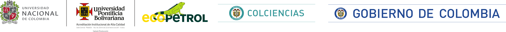

---

# pyROVmotion
## Python modules suite for steady-state and time-domain analysis for Remotely Operated Vehicles (ROV)
This repository contains Python modules for configuring and running steady-state and time-domain computations of ROV motion.
The user may use the modules for analyzing ROV motion feasibility or just computing time-domain motion scenarios.
The modules bring the user classes to configure and run the computation scenarios.

The code herein has been written by:  
Juan A. Ramirez-Macias  
Universidad Pontificia Bolivariana  
Colombia

The work has been funded by:
- Colciencias
- Ecopetrol
- Universidad Pontificia Bolivariana
- Universidad Nacional de Colombia

The suite contains the following modules:
1. **rov.py**: to simulate ROVs in the time domain (not released yet).
2. **kinematics.py**: that defines useful kinematics-related functions.
3. ... more coming up
